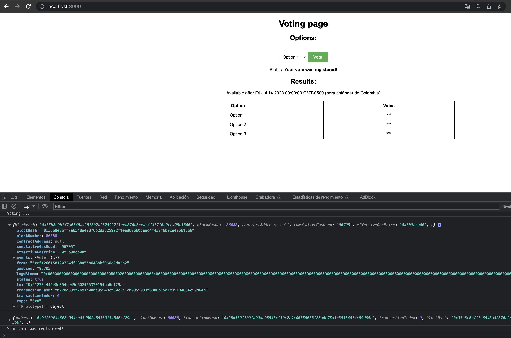
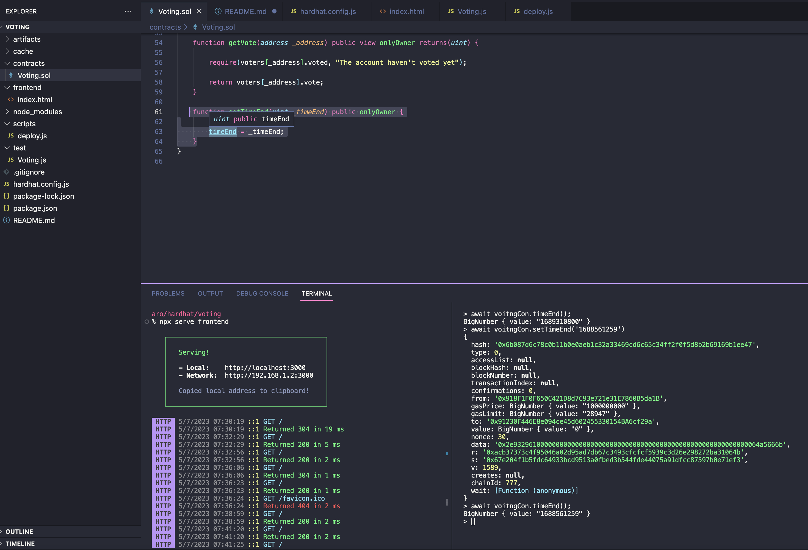
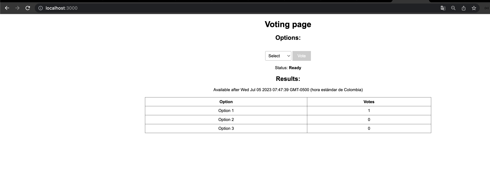

# Voting Hardhat Project

This project contains a voting logic, according delivery constraints.

These are some tests screenshots done:

1. Choose an option and vote

2. To avoid wait until endTime, I used the hardhat console to interact directly and change the endTime (just for test)

3. Go back to the home page and the obfuscation will disappear and show the voting results (the vote made in the first step)

